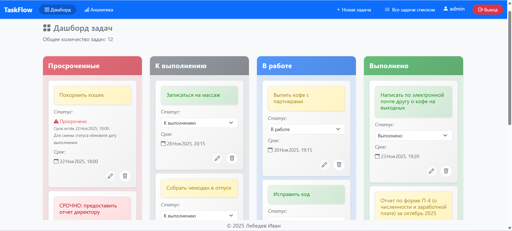
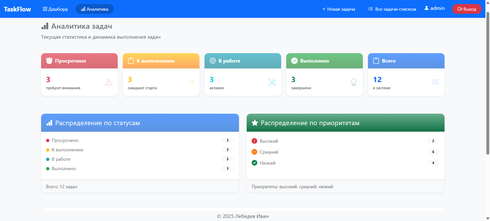
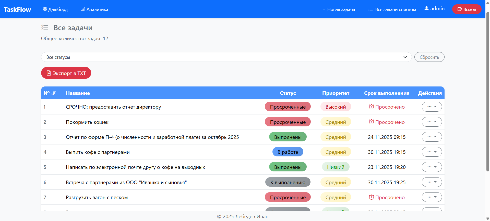
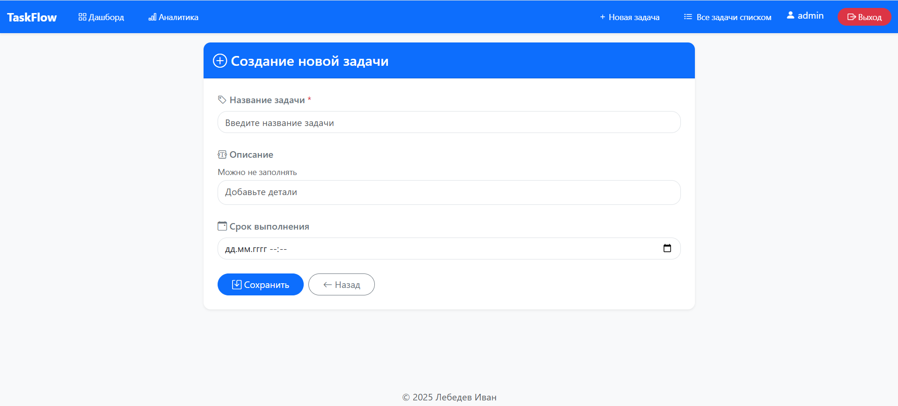

# TaskFlow - Система управления задачами
## Описание проекта
TaskFlow - это веб-приложение для управления задачами. Система позволяет пользователям создавать, редактировать и отслеживать задачи, а также анализировать свою продуктивность.

## Основные возможности
- Управление задачами: создание, редактирование, удаление и отслеживание статуса задач;
- Система статусов: задачи могут иметь статусы "К выполнению", "В работе", "Выполнены" и "Просрочены";
- Приоритеты задач: автоматическое определение приоритета на основе содержания задачи;
- Аналитика: статистика по статусам и приоритетам задач;
- Экспорт данных: возможность экспорта списка задач в текстовый файл;
- Аутентификация: система регистрации и авторизации пользователей.

## Скриншоты приложения
<p align="center">
  
  
  
  
  
</p>

## Используемые технологии
- Python 3.10.11
- Django 5.2.8
- PostgreSQL (для продакшена) или SQLite (для разработки)
- Bootstrap 5 (адаптивный интерфейс)
- Chart.js (построение графиков)
- Django ORM (работа с базой данных)

## Локальный запуск проекта
- Клонируйте репозиторий и перейдите в папку проекта:

```bash
git clone git@github.com:ivanlbdv/taskflow.git
cd taskflow
```
- Создайте и активируйте виртуальное окружение:

```bash
python -m venv venv
source venv/Scripts/activate
```
- Обновите пакетный менеджер:

```bash
python -m pip install --upgrade pip
```
- Установите модули из файла requirementst.txt:

```bash
pip install -r requirements.txt
```

- Создайте файл .env и добавьте в него:

```   
SECRET_KEY=your_secret_key
DEBUG=True
DB_NAME=budget_db
DB_USER=your_user
DB_PASSWORD=your_password
DB_HOST=localhost
DB_PORT=5432
```

- Выполните миграции:

```bash
python manage.py migrate
```

- Создайте суперпользователя:

```bash
python manage.py createsuperuser
```

Следуйте инструкциям в терминале для ввода email и пароля.

- Запустите сервер разработки:

```bash
python manage.py runserver
```

Проект будет доступен по адресу: http://127.0.0.1:8000/

## Автор:
Иван Лебедев
https://github.com/ivanlbdv